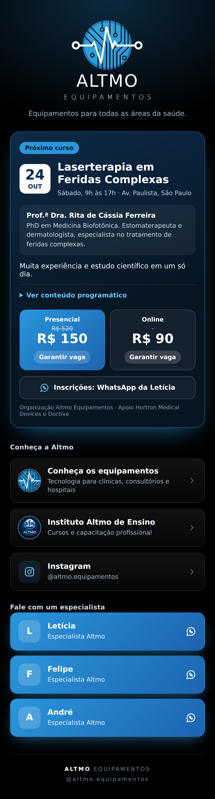

<div align="center">

# ✦ Altmo Equipamentos | Link da Bio

**Uma página de links pensada para vender: curso em destaque, atendimento direto e a marca da Altmo em cada detalhe.**


[](https://welumen.com.br/)



</div>

---

## Sobre o projeto

A **Altmo Equipamentos** vende tecnologia para todas as áreas da saúde e usa o Instagram como principal vitrine. O link da bio era o ponto onde o interesse esfriava: um endereço só, sem destaque para o que importa no momento.

A **We Lúmen** criou uma página sob medida que resolve isso:

- Quem chega pelo Instagram vê **primeiro o curso do mês**, com data, local, professora e preço
- A **inscrição acontece em um toque**, direto no WhatsApp, com a mensagem já escrita
- Os **especialistas** ficam a um toque de distância, cada um com seu botão
- O **site** e o **Instituto Altmo de Ensino** continuam no mesmo lugar, com o logo de cada um

## Destaques

| | |
| --- | --- |
| 🎯 **Foco no que converte** | O curso em evidência abre a página, com botões de inscrição presencial e online |
| 💬 **WhatsApp com contexto** | Cada botão abre a conversa com mensagem pronta, o que facilita o atendimento |
| 🎨 **Identidade da marca** | Fundo preto e azul do logo da Altmo, ícones e favicon com os símbolos oficiais |
| 📱 **Pensado para celular** | Layout feito para o Instagram, onde a maioria dos acessos acontece |
| ⚡ **Leve e rápido** | Um único arquivo, sem frameworks, sem build, sem bibliotecas externas |
| ♿ **Acessível** | Contraste alto, foco visível no teclado e respeito à preferência de movimento reduzido |

## Tecnologias

- HTML5 e CSS3 puros (Grid, Flexbox, variáveis CSS, `prefers-reduced-motion`)
- Imagens embutidas em Base64, o que mantém tudo em um arquivo só
- Tipografia Montserrat (Google Fonts), a mesma família do logo, com fonte alternativa
- Hospedagem gratuita no GitHub Pages

## Estrutura

```
.
├── index.html        # a página inteira
├── docs/
│   └── preview.png   # imagem de prévia usada neste README
└── README.md
```

## Como publicar

1. Suba o `index.html` e a pasta `docs/` neste repositório
2. Vá em **Settings > Pages**
3. Escolha a branch `main` e a pasta `/ (root)`
4. Aguarde alguns minutos: a página fica em `https://<usuario>.github.io/<repositorio>/`

Para usar um domínio próprio (ex.: `links.altmoequipamentos.com.br`), preencha **Custom domain** na mesma tela e crie o registro no DNS.

## Como atualizar

Abra o `index.html` em qualquer editor de texto:

| O que mudar | Onde procurar |
| --- | --- |
| Dados do curso | `<section class="event"` |
| Preços | classes `pv` (valor) e `old` (valor riscado) |
| Conteúdo programático | lista dentro de `<details>` |
| WhatsApp dos especialistas | `api.whatsapp.com/send?phone=55...` |
| Cores da marca | variáveis `--blue` e `--deep`, no início do `<style>` |

O número de WhatsApp vai no formato internacional, sem espaços ou traços: `55` + DDD + número.

Quando o curso terminar, basta trocar o bloco `<section class="event">` pelo próximo curso ou removê-lo. O resto da página segue funcionando.

## Resultado esperado

- Menos cliques entre o interesse no Instagram e a conversa com um especialista
- Divulgação de cursos e lançamentos sem precisar trocar o link da bio
- Uma vitrine com cara profissional, alinhada ao posicionamento da marca

## Sobre a We Lúmen

A [**We Lúmen**](https://welumen.com.br/) desenvolve sites e materiais digitais que ajudam empresas a se apresentar melhor e a transformar visitas em contatos.

- 🌐 Site: <https://welumen.com.br/>
- 📸 Instagram: <https://www.instagram.com/welumenoficial/>
- 💬 WhatsApp: <https://wa.me/5511968106788>

## Direitos de uso

Código e layout desenvolvidos pela We Lúmen para a Altmo Equipamentos. Os logos, textos e dados do curso pertencem à Altmo Equipamentos e ao Instituto Altmo de Ensino, e não devem ser reutilizados sem autorização.

---

<div align="center">

Feito com ✦ pela [**We Lúmen**](https://welumen.com.br/)

</div>
